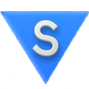
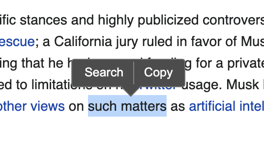
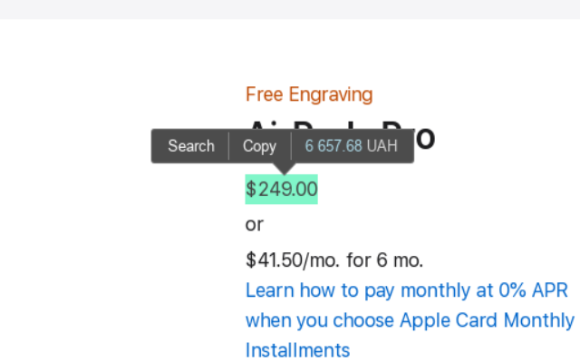
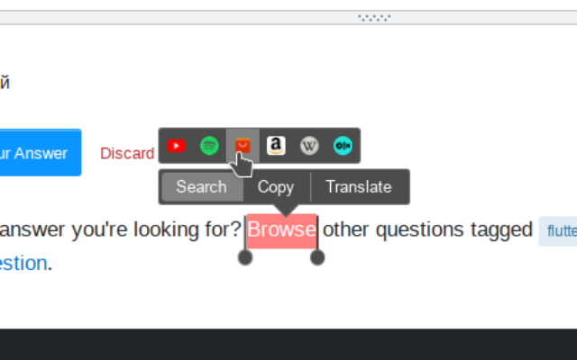

<!-- # <sub></sub> SelectON — text selection popup -->
### 

[](./CHANGELOG.md)
[](https://chrome.google.com/webstore/detail/selection-actions/pemdbnndbdpbelmfcddaihdihdfmnadi)
[](https://addons.mozilla.org/firefox/addon/selection-actions/)
[](https://chrome.google.com/webstore/detail/selecton/pemdbnndbdpbelmfcddaihdihdfmnadi/reviews)

[](https://ko-fi.com/emvaized)


<!-- > Customizable pop-up with action buttons on text selection! -->
### Features
* Copy or search any text in one click - especially useful for laptops
* Customizable appearance for tooltip and custom text selection color
* Currency converter (supports 30+ currencies & 10+ crypto currencies)
* Basic units converter (metric/imperial) and timezones conversion
* Contextual buttons depending on selected text, such as 'Open link', 'Translate', 'Show on map', CSS color preview and more 
* Smart selection - automatic snapping of text selection by words, so you'll never lose that last letter again
* Selection handles, which allow to quickly edit text selection
* Live translation of the selected text on hovering the "Translate" button
* Dictionary button, which fetches definition from Wikipedia on hover
* Highlighter button, which allows to highlight specific text on page and quickly find it later

<a href="https://addons.mozilla.org/firefox/addon/selection-actions/"></a> &nbsp; <a href="https://chrome.google.com/webstore/detail/selection-actions/pemdbnndbdpbelmfcddaihdihdfmnadi"></a>


## Screenshots
|  |
|-|
<details>
<summary>More screenshots</summary>

|  |
|-|
|  |
|-|

</details>


## FAQ

Moved to the Wiki page – [read here](https://github.com/emvaized/selecton-extension/wiki/FAQ-(Frequently-Asked-Questions))

## Donate
If you really enjoy this project, please consider supporting its further development by making a small donation using one of the ways below! 

<a href="https://ko-fi.com/emvaized"></a> &nbsp; <a href="https://liberapay.com/emvaized/donate"></a> &nbsp; <a href="https://emvaized.github.io/donate/bitcoin/"></a>

## Currency conversion
In order to make extension more autonomous, currency rates are set to be updated every 2 weeks, and at the moment of conversion data may not be 100% accurate. Currency conversion output is intended to be used only for a quick estimation. You can decrease update interval in extension's settings if needed, but minimal value for now is 7 days to not cause too much load on API servers. Currency rates are fetched from fawazahmed0's [currency-api](https://github.com/fawazahmed0/exchange-api/blob/main/README.md).

<details>
  <summary>List of the supported currencies</summary>
  
```
AUD — Australian Dollar
BGN — Bulgarian Lev
BRL — Brazilian real
CAD — Canadian Dollar
CHF — Swiss Franc
CNY — Chinese Yuan
CRC — Costa Rican Colon 
CZK — Czech Koruna
DKK — Danish Krone 
EUR — Euro
GBP — British Pound 
HKD — Hong Kong dollar
ILS — Israeli New Sheqel
INR — Indian Rupee
IRR — Iranian Rial
JPY — Japanese Yen
KPW — North Korean Won
KRW — South Korean Won
KZT — Kazakhstani Tenge
MNT — Mongolian Tugrik 
MXN — Mexican Peso
NGN — Nigerian Naira
NOK — Norwegian krone
PLN — Polish złoty
RUB — Russian Ruble
SAR — Saudi Riyal
SEK — Swedish Krona
TRY — Turkish Lira 
UAH — Ukrainian Hryvnia
USD — United States Dollar
VND — Vietnamese Dong
ZAR — Rand

Crypto:
BTC — Bitcoin
ETH — Etherium
LTC — Litecoin
ADA — Cardano
BCH — Bitcoin Cash
XRP — Ripple
ZEC — Zcash
XMR — Monero
ZCL — ZClassic
DOGE — Dogecoin
IOTA (MIOTA)
EOS
```
</details>

## Contribution
You can make SelectON better without even knowing how to code:
- Provide translation for your language: [Base English file](./src/assets/_locales/en/messages.json)
- Add your currency to the list of supported currencies: [Currencies list](./src/data/currencies.js)
- SelectON relies on looking for keywords in the selected text. Enhance them with keywords for your language: [Keywords](./src/data/keywords.js)

Make your changes, and then create pull request here on GitHub so I can merge it.
Also, you can always write me an [email](mailto:maximtsyba@gmail.com) to share your ideas and suggestions.

**Some ideas for future releases**

- [ ] Advanced buttons editor, which allows to quickly turn on/off buttons and change reorder them with drag'n'drop
- [ ] Cloud sync of settings using browser account sync
- [ ] Ability to turn on/off background blur for tooltip and hover panels
- [ ] Make separate tab for markers in the extension popup, with separate category for markers for currently open page

## Building
- `npm install` to install all dependencies
- `npm run build` to generate `dist` folder with minimized code of the extension

## Links to my other browser extensions
* [Circle Mouse Gestures](https://github.com/emvaized/circle-mouse-gestures) – better mouse gestures, with visual representation of all available actions
* [Google Search Tweaks](https://github.com/emvaized/google-tiles-extension) – set of tweaks for Google search page to make it easier to use
* [Open in Popup Window](https://github.com/emvaized/open-in-popup-window-extension) – quickly open any links and images in a small popup window with no browser controls
* [Linkover](https://github.com/emvaized/linkover-extension) – load info about any link on mouse hover or on a long click